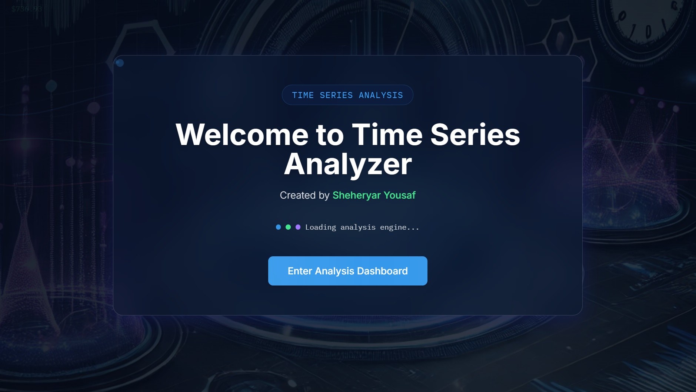

# Time Series Analysis Visualizer

<div align="center">
  
  
  [](https://reactjs.org/)
  [](https://www.typescriptlang.org/)
  [](https://tailwindcss.com/)
</div>

## 📚 Overview

This project was developed by Sheheryar Yousaf as part of the Time Series and Data Analysis course at the university. It's an interactive web application that visualizes and analyzes time series data, demonstrating key concepts in time series analysis and functional data analysis.

## 🎯 Project Objectives

- Implement and visualize time series data generation and analysis
- Demonstrate noise addition and smoothing techniques
- Showcase functional data analysis concepts
- Provide an interactive learning tool for time series analysis

## 🧮 Mathematical Foundations

### 1. Time Series Generation
```typescript
// Base sine wave generation
const time = Array.from({ length: n }, (_, i) => (i / n) * 2 * Math.PI);
const baseSine = time.map(t => Math.sin(t));
```
- Generates a fundamental periodic signal
- Uses sine function to create smooth oscillations
- Represents stationary time series data

### 2. Noise Addition
```typescript
const noisyCurves = Array.from({ length: numCurves }, () => 
  baseSine.map(y => y + (Math.random() - 0.5) * noiseLevel)
);
```
- Adds random variations to the base signal
- Implements white noise with controlled variance
- Simulates real-world measurement errors

### 3. Smoothing Function
```typescript
const smoothCurves = noisyCurves.map(curve => {
  const windowSize = Math.floor(nbasis / 2);
  return curve.map((_, i) => {
    const start = Math.max(0, i - windowSize);
    const end = Math.min(n, i + windowSize + 1);
    const window = curve.slice(start, end);
    return window.reduce((a, b) => a + b, 0) / window.length;
  });
});
```
- Implements moving average smoothing
- Uses window-based averaging to reduce noise
- Balances between smoothness and detail preservation

## 🛠️ Technical Implementation

### Core Technologies
- **Frontend**: React + TypeScript
- **UI Framework**: Tailwind CSS
- **Animation**: Framer Motion
- **Charts**: Recharts
- **Math Processing**: MathJS
- **Routing**: React Router
- **Build Tool**: Vite

### Key Features
- Interactive time series visualization
- Real-time data generation and analysis
- Multiple curve visualization
- Noise level control
- Smoothing functionality
- Responsive design
- Modern UI with glass-morphism effects

## 📊 Mathematical Functions Used

1. **Sine Function**
   - Generates periodic time series data
   - Represents cyclical patterns in data

2. **Random Number Generation**
   - Adds controlled noise to the signal
   - Simulates measurement errors

3. **Moving Average**
   - Implements data smoothing
   - Reduces noise while preserving trends

4. **Window-based Operations**
   - Handles edge cases in smoothing
   - Maintains data integrity

## 🚀 Getting Started

1. Clone the repository
   ```bash
   git clone [repository-url]
   ```

2. Install dependencies
   ```bash
   npm install
   ```

3. Start the development server
   ```bash
   npm run dev
   ```

4. Build for production
   ```bash
   npm run build
   ```

## 📁 Project Structure

```
src/
├── components/          # React components
│   ├── welcome/        # Welcome screen components
│   └── Dashboard.tsx   # Main analysis dashboard
├── pages/              # Page components
├── public/             # Static assets
└── App.tsx            # Main application component
```

## 📚 Course Relevance

This project covers several key concepts from the Time Series and Data Analysis course:

1. Time Series Data Overview
2. Estimation and Elimination of Trend Components
3. Stationary Processes
4. Functional Data Analysis
5. Data Smoothing and Noise Reduction
6. Visualization of Time Series Data

## 🤝 Contributing

This is a university project, but suggestions and improvements are welcome. Please feel free to submit issues or pull requests.

## 📄 License

This project is licensed under the MIT License - see the [LICENSE](LICENSE) file for details.

## 👨‍💻 Author

- **Sheheryar Yousaf** - [GitHub Profile](https://github.com/imSheheryar)

---

<div align="center">
  <sub>Built with ❤️ for Time Series and Data Analysis</sub>
</div>

